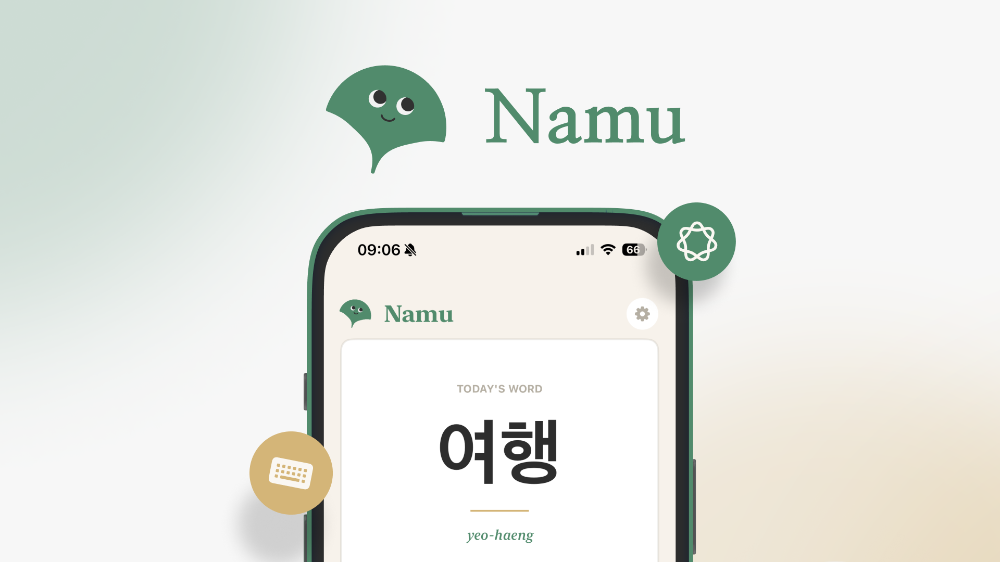

# Welcome to Namu 👋

We are the creators and maintainers of **Learn Korean Daily with Namu** — an iOS app designed to help K-pop, K-drama, and Korean culture fans learn Korean naturally, one day at a time.

  

## About Namu

Unlike traditional language apps, **Namu** is not a rigid course. There are no levels to complete, no stressful streaks, and no XP to chase. Every single day, learners get one new Korean word or phrase featuring:
* **Hangul:** Watch each character come to life stroke by stroke.
* **Native Pronunciation:** Natural-sounding audio with a phonetic guide.
* **Cultural Context:** Discover how words appear in K-pop lyrics, K-drama scenes, and everyday life.
* **AI Conversation Tutor:** Practice right away via Voice Mode (like a real phone call with live pronunciation feedback) or Chat Mode with instant tap-to-translate.

## Connect & Explore

* **[Download on the App Store](https://apps.apple.com/br/app/learn-korean-daily-with-namu/id6760951897)**
* **[Official Website](https://www.appnamu.com/)**
* **[Instagram @namu.ios](https://www.instagram.com/namu.ios/)**
* **[TikTok @namu.ios](https://www.tiktok.com/@namu.ios/)**
* **[Terms of Service & Subscriptions](https://www.appnamu.com/terms)**

## Repository Structure & Open Source Plans

Currently, our organization repositories are kept private while we build out the core product. 
* Moving forward, our iOS application core will remain private, but we plan to open up selected tools, utilities, and public issue trackers/mirrors so the community can follow along and contribute.

## Get in Touch

Have feedback, questions, or just want to say hi? Send us a message at **[contact@namu.tuildes.dev](mailto:contact@namu.tuildes.dev)**!
